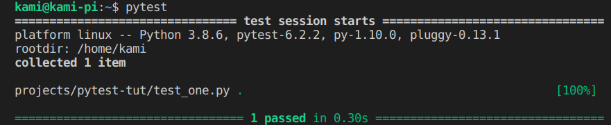
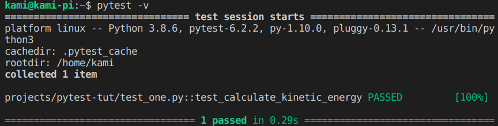
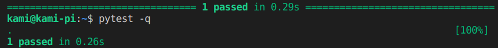
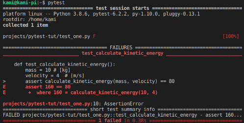

# Pytest Introduction & Instructions

## Download pytest

Enter the following command in your terminal:

> $ pip install pytest

Note: If you get an the following warning:

```zsh
WARNING: The scripts py.test and pytest are installed in '/home/your-username/.local/bin' which is not on PATH.
```

Add the installation path  (/home/your-username/.local/bin) to your PATH,  by running the following command:

```zsh
> $ export PATH="$HOME/.local/bin:$PATH"
```

## Getting Started with pytest

Pytest works by finding test files and then running test classes and test functions in them. \
It finds the tests by searching in current folder and sub-folders for any files whose names starts or ends with  **\_test** or **test\_** respectively as follows:

1. test_*.py
2. *_test.py

Now, let’s write a test:

1. Create a folder called pytest-tut and cd into it.

    ```zsh
    > mkdir pytest-tut
    > cd pytest-tut
    ```

2. Create a python script and open it.

    ```zsh
    > code test_one.py
    ```

3. Write the following in the script:

    ```python
    # test_one.py

    def calculate_kinetic_energy(mass, velocity): 
        """Returns kinetic energy of mass [kg] with velocity [ms]."""
        return 0.5 * mass * velocity ** 2
    ```

    Assume we want to test the above method using pytest. To do so, we  write (in the same file):

    ```python
    def test_calculate_kinetic_energy():
        mass = 10 # [kg]
        velocity = 4 # [m/s]
        assert calculate_kinetic_energy(mass, velocity) == 80
    ```

    In the next step, we will run pytest to see whether our test case `test_calculate_kinetic_energy` will pass or not.

4. Assuming your are in the folder containing test_one.py, run the following command:

    ```zsh
    > pytest
    or
    > pytest test_one.py
    ```

    What do you see? You should see something similar to the following:

    

    The dot after test_one.py means that one test was run and it passed. \
    The [100%] shows the overall progress of running all test cases. \
    Since there is just one test here, one test is 100% of the tests. If you have two tests, each would be 50%.

If you need more information, you can use -v or –verbose:

```zsh
> pytest -v 
```



To have a brief output, you use -q or --quiet flag:



Now let’s write a failing test to see how pytest behaves. \
Assume a new programer joins the team and he mistakenly removes 0.5 in the kinetic energy formula as follows:

```python
def calculate_kinetic_energy(mass, velocity): 
    """Returns kinetic energy of mass [kg] with velocity [ms]."""
    return mass * velocity ** 2
```

Fortunately, there is a unit test for this function. Let’s see how pytest catch this bug. Make sure you have changed your program to reflect the bug. \
Then run the following command in the terminal:
```> pytest```

You get a similar output:



The failing test, test_calculate_kinetic_energy(), gets its own section to show us why it failed: the calculate_kinetic_energy(10, 4) returned 160 but it should have become 80 instead. \
Much of this is in red to make it really stand out (if you’ve got a color terminal). \
As you see, pytest is a powerful tool to test your code.

---

### Test for Exception

Assume you have a function that should raise an exception in a particular situation. \
You want to write a test to make sure the function rasies the exception. \
How would you do that with pytest?

Consider the following code:

```python
# test_exception.py
def palindrome(word):
    if not isinstance(word, str):
        raise TypeError('Please provide a string argument')
    return word == word[::-1]
```

This code checks whether a word is a palindrome or not. For example, it return True if we give it ‘hannah’ and False for ‘kami’. \
Also it raises a TypeError exception if the input parameter is not a string. For example, the method call

```python
palindrome(44)
```

leads to:

```python
TypeError: Please provide a string argument
```

Assume you have been assinged to write a unit test for this function so that your test verifies the function raises TypeError exception in case somebody passed a non-string value to it. How would you do that?

We write the unit test as follows:

```python
import pytest

def test_palindrom():
    with pytest.raises(TypeError):
        palindrome(44)

```

---

## Pytest Fixtures

**Note:** This section has been chosen from a blog post titled [Testing Python Applications with Pytest](https://semaphoreci.com/community/tutorials/testing-python-applications-with-pytest) by Kevin Ndung'u Gathuku.

Consider the following class:

```python
# wallet.py

class InsufficientAmount(Exception):
    pass


class Wallet(object):

    def __init__(self, initial_amount=0):
        self.balance = initial_amount

    def spend_cash(self, amount):
        if self.balance < amount:
            raise InsufficientAmount('Not enough available to spend {}'.format(amount))
        self.balance -= amount

    def add_cash(self, amount):
        self.balance += amount

```

Consider the constructor of the class. If the caller does not pass any initial amount, the defulat value of 0 will be set to self.balance. Otherwise, the value sent to the constructor is set to the ```self.balance```.

Now, let’s write some unit test for the above class in a different file:

```python
# test_wallet.py

import pytest
from wallet import Wallet, InsufficientAmount


def test_default_initial_amount():
    wallet = Wallet()
    assert wallet.balance == 0

def test_setting_initial_amount():
    wallet = Wallet(100)
    assert wallet.balance == 100

def test_wallet_add_cash():
    wallet = Wallet(10)
    wallet.add_cash(90)
    assert wallet.balance == 100

def test_wallet_spend_cash():
    wallet = Wallet(20)
    wallet.spend_cash(10)
    assert wallet.balance == 10

def test_wallet_spend_cash_raises_exception_on_insufficient_amount():
    wallet = Wallet()
    with pytest.raises(InsufficientAmount):
        wallet.spend_cash(100)

```

Now run the test:

```bash
> pytest -q test_wallet.py
.....
5 passed in 0.01 seconds
```

All tests will run successfully.

Now, let’s rewrite our test using fixtures to see how they help us to shorten our tests.

### Re-write our test with Fixtures

You may have noticed some repetition in each test function. Can you spot them? The repetition happened in creation of ‘wallet’ object. In every test funciton, we have created Wallet() object with different initial values. We can rewrite them using fixtures:

```python
# test_wallet.py

import pytest
from wallet import Wallet, InsufficientAmount

@pytest.fixture
def empty_wallet():
    '''Returns a Wallet instance with a zero balance'''
    return Wallet()

@pytest.fixture
def wallet():
    '''Returns a Wallet instance with a balance of 20'''
    return Wallet(20)

def test_default_initial_amount(empty_wallet):
    assert empty_wallet.balance == 0

def test_setting_initial_amount(wallet):
    assert wallet.balance == 20

def test_wallet_add_cash(wallet):
    wallet.add_cash(80)
    assert wallet.balance == 100

def test_wallet_spend_cash(wallet):
    wallet.spend_cash(10)
    assert wallet.balance == 10

def test_wallet_spend_cash_raises_exception_on_insufficient_amount(empty_wallet):
    with pytest.raises(InsufficientAmount):
        empty_wallet.spend_cash(100)


```

In the above code, we have defined two fixture functions:

1. wallet()
2. empty_wallet()

The ```@pytest.fixture``` decorator is used to tell pytest that a function is a fixture. When you put the fixture name (‘empty_wallet’ or ‘wallet’) in the parameter list of a test function, pytests runs the fixture and replaces the parameter with it before running the test. In other words, these two fixture functions are used to initialize the method parameters ‘wallet’ and ‘empty_wallet’ respectively in test functions.

Generally speaking, fixtures are functions that pytest runs them before (and sometimes after) the actual test function.

It is notable that each test is provided with a newly-initialized ‘Wallet’ instance, and not one that has been used in another test. Also it is a good practice to add docstirngs to your fixture functions. It helps you and other testers to quickly understand the fixure functions and their specific purpose.

**Note:** Read section "Parametrized Test Functions" and "Combining Test Fixtures and Parametrized Test Functions" on [this blog post](https://semaphoreci.com/community/tutorials/testing-python-applications-with-pytest).

[Head Back](./readme.md)
